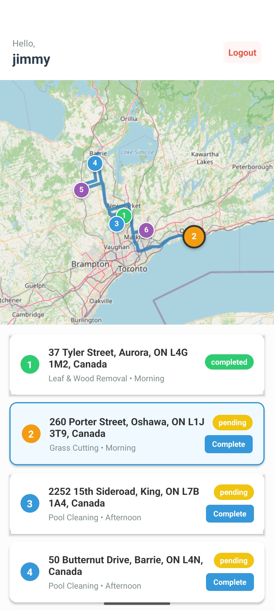

# Vector Property Maintenance

Sample landing page for "Vector Property Maintenance" business. 

Monorepo architechture. Standard front-end to server build, with mobile Android .apk file.
* Server reads and writes to Firestore database, updates front-end booking view dynamically, calculates minimum distance daily routes, and separates completed work orders into separate collections to keep database reads efficient.
* Web (front-end) communicates through server only.
* Mobile application (consumer) is a WebView of the front-end.
* Mobile application (worker) is react-native + WebView.

Admin can add workers and schedule workers using Postman at API endpoints.
* https://vectorpropertymaintenance.onrender.com/api/admin/create-worker
* https://vectorpropertymaintenance.onrender.com/api/admin/assign-schedule

## Worker's Mobile Application

  

## Getting Started

https://vector-property-maintenance.web.app
